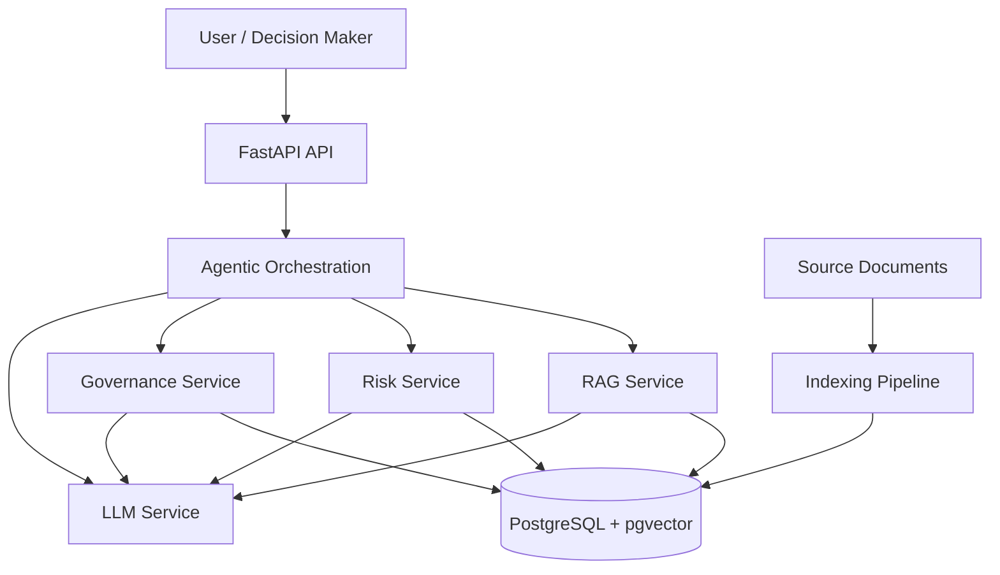

# AI Risk Decision Engine

An AI-assisted decision-support system that combines **retrieval-augmented generation (RAG), cybersecurity risk analysis, governance and compliance evidence, and agentic AI** to support explainable cybersecurity risk decisions.

> **Research / Engineering Project**
> Exploring how agentic AI can integrate cybersecurity governance, compliance evidence, and risk analysis into explainable decision support.

---

## Overview

Cybersecurity risk decisions often require information from multiple sources:

* security policies;
* regulatory requirements;
* technical standards;
* risk assessments;
* security controls;
* organizational governance requirements;
* contextual business information.

Traditional approaches frequently separate these sources and require analysts to manually collect, interpret, and reconcile the information.

The **AI Risk Decision Engine** explores an architecture in which AI agents can retrieve relevant evidence, evaluate risk and governance considerations, and produce an explainable decision-support output.

The system is designed around a key principle:

```text
Evidence
   ↓
Retrieval
   ↓
Risk Analysis
   ↓
Governance Analysis
   ↓
LLM Reasoning
   ↓
Explainable Decision Support
```

The LLM is treated as a reasoning and synthesis component rather than as the authoritative source of evidence or the sole risk calculation engine.

---

# Objectives

The project has five primary objectives.

### 1. Evidence Retrieval

Retrieve relevant cybersecurity, governance, compliance, and risk information using RAG.

### 2. Risk Analysis

Apply structured risk analysis to identified threats, vulnerabilities, impacts, exposures, and controls.

### 3. Governance and Compliance Analysis

Identify relevant governance requirements, control requirements, and compliance considerations.

### 4. Agentic Orchestration

Use agents to coordinate retrieval, risk analysis, governance analysis, and LLM reasoning.

### 5. Explainable Decision Support

Produce decisions that can be traced back to the evidence and reasoning supporting them.

---

# Architecture



---

# Core Workflows

## Offline / Indexing

Source documents are converted into searchable knowledge.

```text
Documents
    ↓
Parsing
    ↓
Cleaning
    ↓
Chunking
    ↓
Embedding
    ↓
PostgreSQL + pgvector
```

The indexed representation retains document and chunk metadata to support retrieval and evidence traceability.

---

## Online / Query

When a user submits a question:

```text
User Question
    ↓
Query Processing
    ↓
Query Embedding
    ↓
Vector Search
    ↓
Top-K Retrieval
    ↓
Reranking
    ↓
Context Construction
    ↓
LLM
    ↓
Answer
```

---

## Risk Decision

For risk-oriented questions, the workflow extends beyond ordinary RAG:

```text
Risk Question
     ↓
Evidence Retrieval
     ↓
Risk Factors
     ↓
Risk Assessment
     ↓
Governance Analysis
     ↓
LLM Synthesis
     ↓
Decision Support
```

The intended output is not simply an LLM-generated answer.

It should provide:

```text
Decision
   +
Risk Assessment
   +
Evidence
   +
Control Gaps
   +
Governance Implications
   +
Recommended Action
```

---

# Technology Stack

| Component             | Technology                         |
| --------------------- | ---------------------------------- |
| Language              | Python                             |
| API                   | FastAPI                            |
| Database              | PostgreSQL                         |
| Vector Search         | pgvector                           |
| ORM / Database Access | SQLAlchemy                         |
| LLM                   | Configurable local / online models |
| Local LLM Runtime     | Ollama                             |
| Agent Orchestration   | LangGraph / agent framework        |
| Testing               | pytest                             |
| Experimentation       | Jupyter                            |
| Containers            | Docker / Docker Compose            |
| CI/CD                 | GitHub Actions                     |
| Version Control       | Git                                |

The architecture is intentionally modular so that individual components can be evaluated and replaced independently.

---

# Repository Structure

```text
ai-risk-decision-engine/
│
├── src/
│   └── app/
│       ├── main.py
│       ├── config.py
│       │
│       ├── api/
│       ├── models/
│       ├── schemas/
│       │
│       ├── services/
│       │   ├── llm/
│       │   ├── rag/
│       │   ├── risk/
│       │   └── governance/
│       │
│       ├── agents/
│       ├── security/
│       ├── governance/
│       ├── risk/
│       └── database/
│
├── documents/
│   ├── raw/
│   ├── processed/
│   └── indexed/
│
├── data/
├── evaluation/
├── research/
├── notebooks/
├── scripts/
├── tests/
│
├── docs/
│   └── architecture/
│       └── system-overview.md
│
├── threat-model/
├── docker/
│
├── docker-compose.yml
├── pyproject.toml
├── .env.example
├── .gitignore
└── README.md
```

---

# Architecture Documentation

Detailed architecture documentation is maintained under:

```text
docs/architecture/
```

| Document                | Purpose                            |
| ----------------------- | ---------------------------------- |
| `system-overview.md`    | Overall system architecture        |


The README provides the high-level view; the architecture documents contain the detailed technical maps.

---

# Getting Started

## Prerequisites

The development environment requires:

* Python 3.x
* Git
* Docker
* Docker Compose
* PostgreSQL / pgvector
* Ollama or an online LLM provider

---

## Clone

```bash
git clone <repository-url>
cd ai-risk-decision-engine
```

---

## Create Python Environment

```bash
python3 -m venv .venv
source .venv/bin/activate
```

Install dependencies:

```bash
pip install -e .
```

---

## Configuration

Create the local environment file:

```bash
cp .env.example .env
```

Configure the required database and model settings.

Secrets must remain in `.env` or an appropriate secret-management system and must never be committed to Git.

---

## Start Infrastructure

```bash
docker compose up -d
```

Check running services:

```bash
docker compose ps
```

---

## Run the API


# Testing

Run the automated test suite with:

```bash
pytest
```

The project separates testing from evaluation.

### Tests

Tests verify that individual components and application workflows behave correctly.

### Evaluation

Evaluation measures the quality of AI-specific behaviour.

```text
Testing
    ↓
Does the software work correctly?

Evaluation
    ↓
Does the AI system produce useful and reliable results?
```

---

# AI Evaluation

The project evaluates the system across multiple dimensions.

## RAG Evaluation

```text
Recall@K
Precision@K
Retrieval relevance
```

The key question is:

> Did the system retrieve the evidence required to answer the question?

---

## Generation Evaluation

```text
Faithfulness
Answer relevance
Citation correctness
Completeness
Hallucination rate
```

The key question is:

> Did the generated answer accurately represent the retrieved evidence?

---

## Risk Evaluation

The risk engine is evaluated separately from the LLM.

The key question is:

> Did the system identify and assess the relevant risk factors correctly?

---

## Decision Evaluation

The complete workflow is evaluated for:

* evidence traceability;
* reasoning quality;
* risk assessment accuracy;
* governance relevance;
* recommendation quality;
* consistency;
* explainability.

---

# Research Direction

The project investigates the following research question:

> **How can agentic AI integrate cybersecurity governance, compliance evidence, and risk analysis into explainable decision support?**

The research explores the intersection of:

```text
Cybersecurity
      +
Governance
      +
Risk Management
      +
Compliance
      +
RAG
      +
LLMs
      +
Agentic AI
      +
Explainable Decision Support
```

The objective is not simply to build a chatbot.

The objective is to investigate whether an AI system can provide a structured and traceable bridge between **evidence, risk analysis, governance requirements, and executive decision-making**.

---

# Design Principles

### Evidence over hallucination

Important conclusions should be grounded in retrieved evidence.

### Separation of concerns

RAG, risk analysis, governance analysis, LLM interaction, and agent orchestration remain separate components.

### Traceability

A decision should be traceable back to the evidence supporting it.

```text
Decision
   ↓
Reasoning
   ↓
Risk Assessment
   ↓
Evidence
   ↓
Source Document
```

### Evaluability

AI behaviour must be measurable rather than assessed solely through subjective inspection.

### Replaceable components

LLM providers, embedding models, rerankers, and other infrastructure components should be replaceable without redesigning the entire application.

### Security by design

Security, privacy, access control, secret management, logging, and threat modelling are treated as architectural concerns rather than later additions.

---

# Project Status

> **Status: Active Research / Engineering Development**

The project is being developed incrementally.

Current development areas include:

* core FastAPI application;
* PostgreSQL and pgvector integration;
* document ingestion;
* RAG indexing;
* RAG query pipeline;
* LLM integration;
* risk-analysis services;
* governance services;
* agent orchestration;
* evaluation framework;
* security and threat modelling.

Features should only be marked as complete when implemented and tested.

---

# Roadmap

```text
[*] Application foundation
[*] PostgreSQL integration
[*] Document ingestion
[*] Embedding pipeline
[*] Vector search
[*] RAG query pipeline
[ ] Reranking
[ ] LLM integration
[ ] Risk assessment engine
[ ] Governance analysis
[ ] Agent orchestration
[ ] Evidence traceability
[ ] RAG evaluation
[ ] Risk evaluation
[ ] End-to-end evaluation
[ ] Threat modelling
[ ] CI/CD
[ ] Production-oriented deployment
```

The roadmap is intentionally incremental: each capability should be implemented, tested, and evaluated before additional agentic complexity is introduced.

---

# Why This Project Matters

Cybersecurity decisions are rarely based on a single source of information.

A meaningful AI decision-support system therefore needs to answer more than:

> "What does the model think?"

It needs to answer:

> **"What evidence was considered, what risks were identified, how were governance requirements interpreted, and why was this recommendation produced?"**

This project explores an architecture for answering those questions systematically.

---

# License

License information will be added as the project moves toward public distribution.
