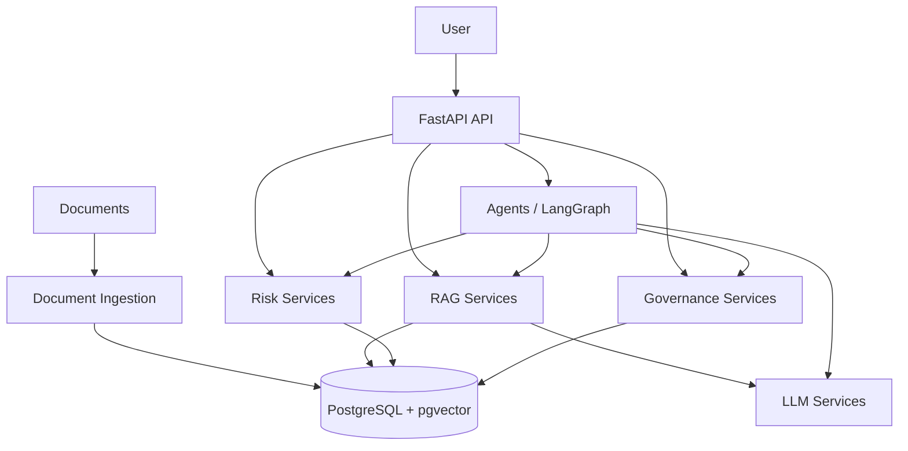

# AI Risk Decision Engine — System Overview

## 1. Purpose

The AI Risk Decision Engine is an application designed to support cybersecurity, governance, compliance, and risk decision-making using:

- document retrieval;
- embeddings and vector search;
- large language models;
- risk assessment logic;
- governance and compliance evidence;
- agentic orchestration;
- structured evaluation.

The system is designed to separate **evidence retrieval**, **reasoning**, **risk calculation**, and **decision support** rather than treating the LLM as the entire application.

---

## 2. High-Level Architecture



---

## 3. Repository Architecture

The application runtime is primarily located under:

```text
src/app/
```

The major components are:

```text
src/app/
│
├── main.py
├── config.py
│
├── api/
├── models/
├── schemas/
├── services/
│   ├── llm/
│   ├── rag/
│   ├── risk/
│   └── governance/
│
├── agents/
├── security/
├── governance/
├── risk/
└── database/
```

The repository also separates supporting development activities:

```text
documents/       Source and processed documents
data/             Data used by the application
evaluation/      Retrieval, generation and risk evaluation
research/        Research experiments
notebooks/       Interactive experimentation
scripts/         Operational and development scripts
docs/            Architecture and technical documentation
threat-model/    Threat modelling
docker/          Container-related configuration
```

---

## 4. Architectural Layers

### API Layer

Location:

```text
src/app/api/
```

Responsible for:

- HTTP endpoints;
- request handling;
- response handling;
- API-level validation;
- dependency injection.

The API layer should remain thin.

It should delegate application behaviour to services rather than implementing business logic directly.

---

### Service Layer

Location:

```text
src/app/services/
```

This is the primary application logic layer.

Major services include:

```text
services/
├── llm/
├── rag/
├── risk/
└── governance/
```

Responsibilities:

```text
LLM
    Model interaction

RAG
    Retrieval and context construction

Risk
    Risk assessment and decision logic

Governance
    Governance and compliance logic
```

---

### Agent Layer

Location:

```text
src/app/agents/
```

Agents coordinate multiple capabilities.

An agent may orchestrate:

```text
RAG
 ↓
Risk analysis
 ↓
Governance analysis
 ↓
LLM reasoning
 ↓
Decision support
```

Agent orchestration should not replace the underlying services.

Agents coordinate services.

---

### Database Layer

Location:

```text
src/app/database/
```

Responsible for:

- database connections;
- sessions;
- repositories;
- persistence;
- database-related infrastructure.

The current architecture uses PostgreSQL with vector-search capability.

---

## 5. Core Architectural Principle

The LLM is one component of the system.

It is not the database.

It is not the retrieval engine.

It is not the risk calculation engine.

It is not the governance database.

The conceptual architecture is:

```text
                 AI Risk Decision Engine
                          │
       ┌──────────────────┼──────────────────┐
       │                  │                  │
       ▼                  ▼                  ▼
     Evidence            Logic             Models
       │                  │                  │
       ▼                  ▼                  ▼
      RAG                Risk              LLM
       │                  │
       └──────────────────┼──────────────────┘
                          ▼
                    Decision Support
```

---

## 6. Offline and Online Architecture

### Offline / Indexing

The indexing pipeline prepares evidence before a user asks a question.

```text
Documents
    ↓
Parsing
    ↓
Cleaning
    ↓
Chunking
    ↓
Embedding
    ↓
Vector Database
```

The resulting indexed evidence is available for later retrieval.

---

### Online / Query

The query pipeline operates when a user asks a question.

```text
User Question
    ↓
Query Processing
    ↓
Query Embedding
    ↓
Vector Search
    ↓
Top-K
    ↓
Reranking
    ↓
Context Construction
    ↓
LLM
    ↓
Answer
```

---

## 7. Decision-Support Principle

The system should distinguish between:

```text
Evidence
   ↓
Retrieved context
   ↓
Analysis
   ↓
Risk assessment
   ↓
Decision
```

This separation is important because an LLM-generated answer should not automatically be treated as authoritative evidence.

The system should preserve the relationship between a decision and the evidence supporting that decision.

---

## 8. Configuration

Application-wide configuration belongs in:

```text
src/app/config.py
```

There should be one central application configuration rather than separate unrelated configuration modules.

Configuration may include:

- PostgreSQL connection settings;
- embedding model;
- RAG parameters;
- LLM provider;
- Ollama settings;
- online LLM settings;
- application environment.

---

## 9. Infrastructure

Infrastructure configuration is separate from Python application configuration.

The repository uses:

```text
docker-compose.yml
```

as the root Docker Compose configuration.

Conceptually:

```text
Python configuration
        │
        ▼
Application behaviour

Docker Compose
        │
        ▼
Infrastructure services
```

These should not be mixed.

---

## 10. Architectural Goal

The target system is therefore:

```text
                         USER
                           │
                           ▼
                       FastAPI
                           │
                           ▼
                     Application
                        Services
                           │
             ┌─────────────┼─────────────┐
             │             │             │
             ▼             ▼             ▼
            RAG           Risk       Governance
             │             │             │
             └─────────────┼─────────────┘
                           │
                           ▼
                         Agents
                           │
                           ▼
                          LLM
                           │
                           ▼
                    Decision Support
                           │
                           ▼
                   Evidence + Answer
```

The architecture is intentionally modular so that individual components can be tested, evaluated, replaced, and improved independently.